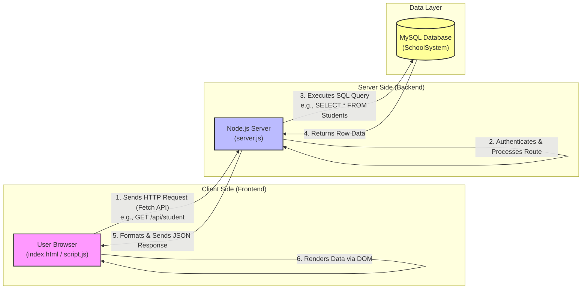

```mermaid
graph LR
    subgraph Client_Side ["Client Side (Frontend)"]
        Browser["User Browser<br>(index.html / script.js)"]
    end

    subgraph Server_Side ["Server Side (Backend)"]
        Node["Node.js Server<br>(server.js)"]
    end

    subgraph Database_Layer ["Data Layer"]
        DB[("MySQL Database<br>(SchoolSystem)")]
    end

    Browser -- "1. Sends HTTP Request (Fetch API)<br>e.g., GET /api/student" --> Node
    Node -- "2. Authenticates & Processes Route" --> Node
    Node -- "3. Executes SQL Query<br>e.g., SELECT * FROM Students" --> DB
    DB -- "4. Returns Row Data" --> Node
    Node -- "5. Formats & Sends JSON Response" --> Browser
    Browser -- "6. Renders Data via DOM" --> Browser

    style Browser fill:#f9f,stroke:#333,stroke-width:2px
    style Node fill:#bbf,stroke:#333,stroke-width:2px
    style DB fill:#ff9,stroke:#333,stroke-width:2px
```